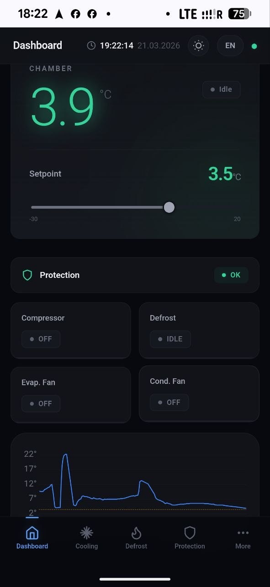
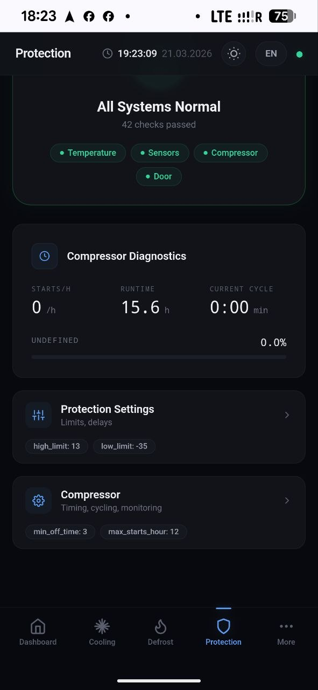
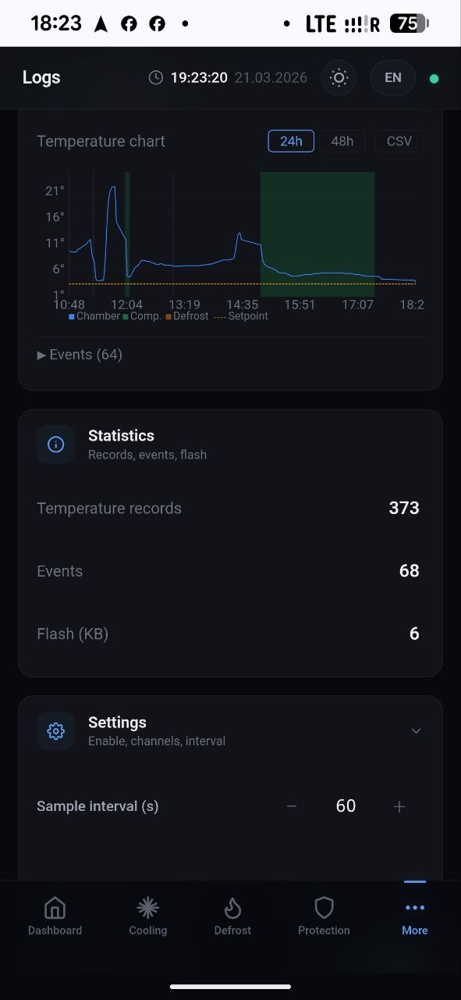
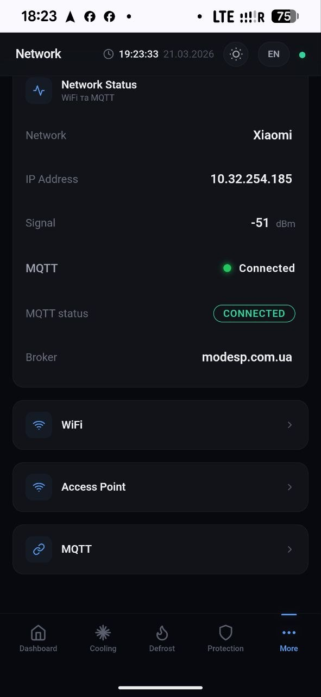

# ModESP v4

**Open-source ESP32 firmware framework for commercial refrigeration — replacing $200+ Danfoss/Dixell controllers with a $4 microcontroller.**

[](https://docs.espressif.com/projects/esp-idf/en/v5.5/)
[](https://isocpp.org/)
[](https://svelte.dev/)
[](tests/)
[](LICENSE)

> Manifest-driven architecture: JSON manifests generate UI, state metadata, MQTT topics, and C++ headers at build time — zero manual sync between firmware, WebUI, and cloud.

<p align="center">
  
  
  
  
</p>

---

## Why ModESP?

| Problem | ModESP Solution |
|---------|----------------|
| Proprietary controllers cost $200–500+ per unit | ESP32-WROOM-32 ($4) + open firmware |
| Closed ecosystems, vendor lock-in | Open architecture, MQTT, REST API, Home Assistant |
| No remote monitoring without expensive gateways | Built-in WiFi + MQTT + TLS, cloud-ready out of the box |
| Rigid configuration, service visits required | WebUI accessible from phone, OTA updates over-the-air |
| One controller model per application | Board abstraction — same firmware, different hardware via JSON config |

**Target market:** cold rooms, display cases, walk-in freezers, transport refrigeration — anywhere a Danfoss ERC/AK or Dixell XR series controller is used today.

---

## Live on Hardware

Verified on ESP32 + KC868-A6 board with real refrigeration equipment:

| Parameter | Value |
|-----------|-------|
| Firmware | v1.0.1 |
| Free RAM | 114 KB (94 KB minimum) |
| Board | KC868-A6 (PCF8574 I2C: 6 relays, 6 inputs) |
| WiFi | STA mode, -51 dBm signal |
| MQTT | Connected (TLS) to modesp.com.ua |
| Protection | All 42 checks passed |
| Uptime | Stable 15+ hours continuous operation |

---

## Key Metrics

| Metric | Value |
|--------|-------|
| State keys | 126 (63 metadata, 50 MQTT pub, 62 MQTT sub) |
| Modules | 5 (equipment, thermostat, defrost, protection, datalogger) |
| Drivers | 6 (DS18B20, NTC, relay, digital input, PCF8574 relay/input) |
| HTTP endpoints | 23 REST + WebSocket + OTA |
| Tests | 491 (310 pytest + 181 C++ host / 418 assertions) |
| WebUI | 80 KB gzipped, Svelte 4, dark/light theme, 4 languages |
| Firmware binary | ~1.2 MB, 94–114 KB free heap |
| Target | ESP32-WROOM-32, 4 MB flash, ESP-IDF v5.5 |

> **Full feature list:** [docs/FEATURES.md](docs/FEATURES.md) | [Українською](docs/FEATURES_UA.md)

---

## How It Works

```
 module manifests ──┐
 driver manifests ──┼──▶  generate_ui.py  ──▶  ui.json        (WebUI schema)
 board.json        ──┤                     ──▶  state_meta.h   (C++ metadata)
 bindings.json     ──┘                     ──▶  mqtt_topics.h  (pub/sub arrays)
                                           ──▶  features_config.h
                                           ──▶  display_screens.h
```

Add a module manifest → rebuild → new parameters appear in WebUI, MQTT, state engine, and persistence automatically. No manual wiring.

### Equipment Arbitration

```
  Thermostat          Defrost           Protection
      │                  │                  │
      │ req.compressor   │ req.defrost      │ lockout / block
      ▼                  ▼                  ▼
  ┌──────────────────────────────────────────────┐
  │           Equipment Manager                   │
  │  Priority: Protection > Defrost > Thermostat  │
  │  Interlocks: defrost ↔ compressor             │
  └──────────────────────────────────────────────┘
      │           │           │           │
    Relay       Relay       Relay       Relay
   (comp)    (evap_fan)  (cond_fan)   (defrost)
```

Business modules publish requests to SharedState. Equipment Manager arbitrates and drives hardware. Modules never touch GPIO directly.

---

## Refrigeration Features

**Thermostat** — 4-state FSM, asymmetric differential, night setback (4 modes), safety run on sensor failure, configurable min on/off times

**Defrost** — 7-phase FSM (stabilize → valve → active → equalize → drip → fan delay → idle), 3 types (natural, electric, hot-gas), 4 initiations (timer, demand, manual, digital input)

**Protection** — 10 independent alarm monitors with 2-level escalation:

| Monitor | Trigger | Escalation |
|---------|---------|------------|
| High/Low temp | Threshold + delay | Warning → lockout |
| Sensor failure (×2) | No reading | Immediate |
| Door open | Contact + delay | Warning |
| Short/Rapid cycle | Frequency detection | Compressor blocked |
| Continuous run | Max runtime exceeded | Forced off → lockout |
| Pulldown failure | Min drop not met | Warning |
| Rate of change | °C/min threshold | Warning |

**DataLogger** — 6 temperature channels, 18 event types, LittleFS storage with rotation, streaming JSON API, chart rendering, CSV export

---

## Web Interface

Svelte 4 SPA — 80 KB gzipped, served from ESP32 LittleFS.

<p align="center">
  
  
  
</p>

- Bento-card dashboard with grouped parameters
- Real-time updates via WebSocket (no polling)
- Dark / light theme, responsive layout for mobile
- **4 languages:** Ukrainian, English, German, Polish (lazy-load from LittleFS)
- Progressive disclosure — UI shows only settings for connected hardware
- GroupAccordion with expand/collapse, parameter validation

---

## Connectivity

- **WiFi** — STA + AP fallback, AP→STA periodic probe (30s–5min backoff), mDNS, STA watchdog
- **MQTT** — TLS (port 8883), delta-publish, heartbeat, LWT, tenant-aware topics, Home Assistant Auto-Discovery
- **HTTP** — 23 REST endpoints: state, settings, bindings, WiFi, OTA, logs, backup/restore
- **WebSocket** — real-time state broadcast, delta updates, max 3 clients
- **Cloud** — [ModESP Cloud](https://github.com/Zapadenec1982/ModESP_Cloud) (default) or AWS IoT Core (compile-time switch)

---

## Board Abstraction

One firmware codebase — different hardware via JSON config:

```
boards/
├── dev/              # ESP32-DevKit (direct GPIO)
│   ├── board.json
│   └── bindings.json
└── kc868a6/          # KC868-A6 (I2C PCF8574 expanders)
    ├── board.json
    └── bindings.json
```

**board.json** describes physical hardware (GPIO, buses, expanders). **bindings.json** maps logical roles (compressor, evap_fan, air_temp) to drivers. Switch board → rebuild → same firmware, different hardware.

| Board | I/O | Interface |
|-------|-----|-----------|
| ESP32-DevKit | GPIO relay + OW + DI + ADC | Direct GPIO |
| KC868-A6 | 6 relay + 6 input | PCF8574 I2C |
| Custom | Any combination | JSON config |

---

## Testing

**491 tests** across two suites:

| Suite | Tests | Coverage |
|-------|-------|----------|
| **pytest** (tools/tests/) | 310 | Manifests, generator, state validation, MQTT topics, API contracts |
| **C++ doctest** (tests/host/) | 181 (418 assertions) | SharedState, thermostat FSM, defrost FSM, protection monitors, equipment arbitration |

```bash
python -m pytest tools/tests/ -v                                             # pytest
cd tests/host && cmake -B build && cmake --build build && ctest --test-dir build  # C++ host
```

---

## Architecture

```
                    ┌──────────────────────────────────────────────┐
                    │              ESP32 (FreeRTOS)                │
                    │                                              │
  ┌──────────┐     │  ┌──────────┐  ┌───────────┐  ┌──────────┐  │
  │ DS18B20  │◄───►│  │Equipment │  │Thermostat │  │ Defrost  │  │
  │ NTC      │     │  │ Manager  │  │  4-state  │  │ 7-phase  │  │
  └──────────┘     │  │  (HAL)   │  │   FSM     │  │   FSM    │  │
                   │  └────┬─────┘  └─────┬─────┘  └────┬─────┘  │
  ┌──────────┐     │       │              │              │        │
  │  Relay   │◄───►│  ┌────▼──────────────▼──────────────▼────┐   │
  │  PCF8574 │     │  │         State Engine (126 keys)       │   │
  │  GPIO    │     │  └────┬──────────┬──────────┬────────────┘   │
  └──────────┘     │       │          │          │                │
                   │  ┌────▼────┐ ┌───▼────┐ ┌──▼─────────┐      │
                   │  │Protection│ │DataLog │ │ NVS        │      │
                   │  │10 alarms│ │6-ch    │ │ Persistence │      │
                   │  │2-level  │ │LittleFS│ │             │      │
                   │  └─────────┘ └────────┘ └─────────────┘      │
                   │                                              │
                   │  ┌──────────────────────────────────────┐    │
                   │  │          Services Layer               │    │
                   │  │  WiFi · MQTT · HTTP · WebSocket · OTA │    │
                   │  └───────┬──────────┬───────────┬───────┘    │
                   └──────────┼──────────┼───────────┼────────────┘
                              │          │           │
                         ┌────▼───┐ ┌────▼────┐ ┌───▼────────┐
                         │  MQTT  │ │ Browser │ │ ModESP     │
                         │ Broker │ │ (WebUI) │ │ Cloud /    │
                         │ (TLS)  │ │ Svelte  │ │ AWS IoT    │
                         └────────┘ └─────────┘ └────────────┘
```

---

## Tech Stack

| Layer | Technology |
|-------|-----------|
| MCU | ESP32-WROOM-32 (4 MB flash, dual-core 240 MHz) |
| Framework | ESP-IDF v5.5, FreeRTOS |
| Language | C++17, ETL (zero heap allocation) |
| JSON parser | jsmn (header-only, zero-alloc) |
| Filesystem | LittleFS (datalog), NVS (parameters) |
| WebUI | Svelte 4, Rollup, 80 KB gzipped |
| Code generation | Python 3 (manifest → 5 artifacts) |
| Testing | doctest (host C++), pytest (integration) |
| Cloud | ModESP Cloud / AWS IoT Core (compile-time) |

---

## Project Structure

```
components/
├── modesp_core/        # BaseModule, ModuleManager, SharedState, types
├── modesp_services/    # Error, Watchdog, Config, Persist, Logger
├── modesp_hal/         # HAL, DriverManager, driver interfaces
├── modesp_net/         # WiFi, HTTP (23 endpoints), WebSocket
├── modesp_mqtt/        # MQTT client with TLS, delta-publish, HA discovery
└── modesp_json/        # JSON serialization (jsmn-based)
modules/
├── equipment/          # HAL owner, arbitration, interlocks
├── thermostat/         # 4-state FSM, fan control, night setback
├── defrost/            # 7-phase FSM, 3 types, 4 initiations
├── protection/         # 10 monitors, CompressorTracker, 2-level escalation
└── datalogger/         # 6-ch temperature + 18 event types (LittleFS)
drivers/                # 6 drivers: ds18b20, ntc, relay, digital_input, pcf8574_*
webui/                  # Svelte 4 source
tools/                  # Python generator + 310 pytest tests
tests/host/             # 181 C++ doctest tests
```

---

## Quick Start

```bash
# Prerequisites: ESP-IDF v5.5, Python 3.8+, Node.js 18+

# Build firmware (auto-generates code from manifests)
idf.py build

# Flash to ESP32
idf.py -p /dev/ttyUSB0 flash monitor

# Build WebUI (optional — pre-built bundle included)
cd webui && npm install && npm run build && npm run deploy
```

---

## Project Status

**v1.0.1 — Production release on real hardware.** All core phases complete.

| Phase | Name | Status |
|-------|------|--------|
| 1–4 | Core Architecture, HAL, Drivers, Equipment Manager | ✅ |
| 5 | WiFi + HTTP API (23 endpoints) + WebSocket + Code Generation | ✅ |
| 6–10 | Thermostat v2, Defrost 7-phase, NTC, DS18B20 SEARCH_ROM | ✅ |
| 11 | MQTT + TLS, OTA with rollback, NVS persist | ✅ |
| 12–15 | Night Setback, KC868-A6, DataLogger, Manifest Standard v2 | ✅ |
| 16 | WebUI Premium Redesign (bento cards, dark theme, i18n) | ✅ |
| 17 | Protection System (10 alarms, 2-level escalation) | ✅ |
| 18 | WiFi + MQTT hardening (AP→STA probe, TLS, delta-publish) | ✅ |

---

## Documentation

| Document | Description |
|----------|-------------|
| [**FEATURES.md**](docs/FEATURES.md) | All firmware capabilities ([🇺🇦 Українською](docs/FEATURES_UA.md)) |
| [ARCHITECTURE.md](ARCHITECTURE.md) | System architecture deep-dive |
| [CLOUD_INTEGRATION.md](docs/CLOUD_INTEGRATION.md) | ModESP Cloud integration |
| [docs/05_cooling_defrost.md](docs/05_cooling_defrost.md) | Thermostat + Defrost spec |
| [docs/07_equipment.md](docs/07_equipment.md) | Equipment Manager + Protection |
| [docs/10_manifest_standard.md](docs/10_manifest_standard.md) | Manifest specification v2 |
| [docs/12_aws_iot.md](docs/12_aws_iot.md) | AWS IoT Core integration |

---

## Technical Highlights

This project demonstrates production-grade embedded engineering across the full IoT stack:

**Firmware Architecture**
- Manifest-driven code generation — JSON manifests produce 5 C++ headers + UI schema at build time
- Zero heap allocation in runtime loops — ETL containers instead of STL
- SharedState engine with 126 typed keys, compile-time metadata, automatic NVS persistence
- Equipment arbitration with safety interlocks — Protection always overrides business logic

**Refrigeration Domain Expertise**
- 4-state thermostat FSM with asymmetric differential and safety run
- 7-phase defrost FSM supporting 3 defrost types and 4 initiation modes
- 10 independent alarm monitors with 2-level escalation (blocked → lockout)
- CompressorTracker: motor hours, cycle counting, continuous-run detection

**Embedded Web & Connectivity**
- Svelte 4 SPA served from ESP32 flash — 80 KB gzipped with WebSocket real-time updates
- 4-language i18n with lazy-loaded language packs (~8 KB each)
- MQTT over TLS with delta-publish, heartbeat, LWT, and Home Assistant Auto-Discovery
- WiFi STA + AP with intelligent probe (exponential backoff, heap guard)

**Hardware Abstraction**
- board.json + bindings.json — same firmware binary on different PCBs
- 6 driver types covering temperature sensors, relays, and I2C expanders
- Dual OTA partitions with SHA-256 verification and automatic rollback

**Quality**
- 491 tests: pytest (manifests, API) + C++ doctest (FSMs, state engine)
- Host-compiled C++ tests — run on desktop without ESP32 hardware
- Continuous code generation validation

---

## License

**Source-available** under [PolyForm Noncommercial License 1.0.0](LICENSE).

Free to use, study, and modify for personal and non-commercial purposes.
Commercial licensing available — contact for partnership opportunities.

---

## Author

**Yurii Tepliuk** — Embedded Systems Engineer, Ukraine

Specializing in industrial IoT: ESP32 firmware, real-time control systems, cloud platforms, and embedded web interfaces. Full-stack — from C++ firmware on bare metal to Svelte UI in the browser and Node.js cloud backend.

- Industrial refrigeration control (replacing Danfoss/Dixell with ESP32)
- ESP-IDF / FreeRTOS / C++17 / ETL — zero-heap embedded development
- Full IoT pipeline: firmware → MQTT/TLS → cloud → WebUI
- 491 firmware tests + 130+ cloud tests in production


---

*ModESP v4 — industrial refrigeration control on a $4 microcontroller.*
